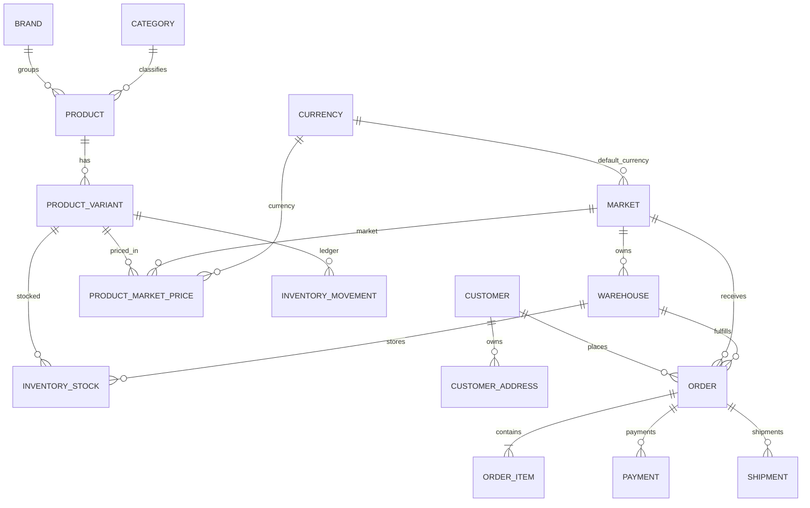

# Architecture

## Service boundaries
- `PricingService`: resolves trusted server-side market pricing.
- `InventoryService`: row-lock based reservation, release and sale commits.
- `CouponService`: discount calculation and validity checks.
- `OrderService`: transaction boundary for order pricing, creation and inventory reservation.

## Rules
1. Controllers never trust frontend price values.
2. Inventory changes require a stock movement record.
3. Market configuration is independent from frontend locale.
4. Historic order item snapshots are retained even if catalog data changes.
5. API contracts are versioned under `/api/v1`.
